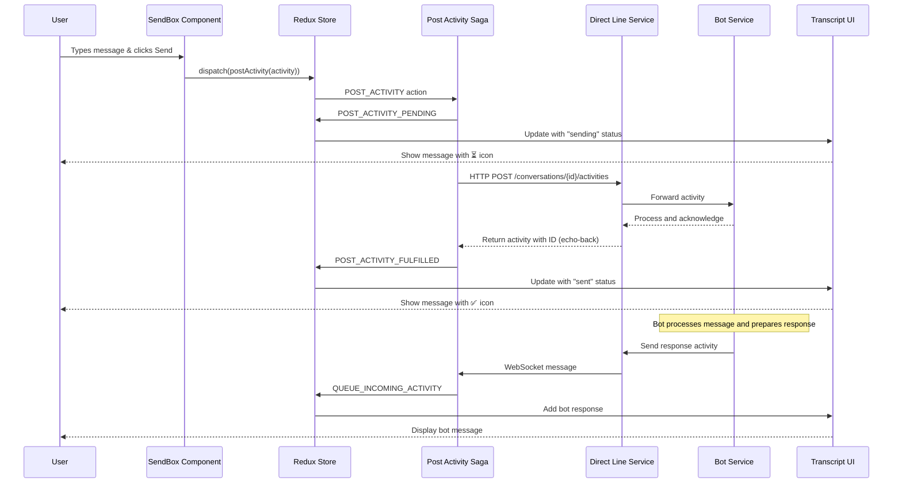
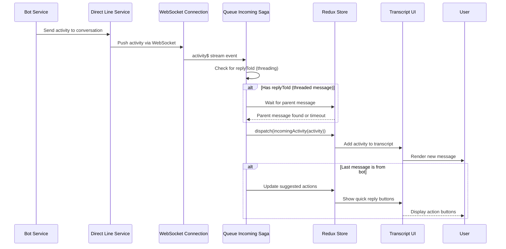
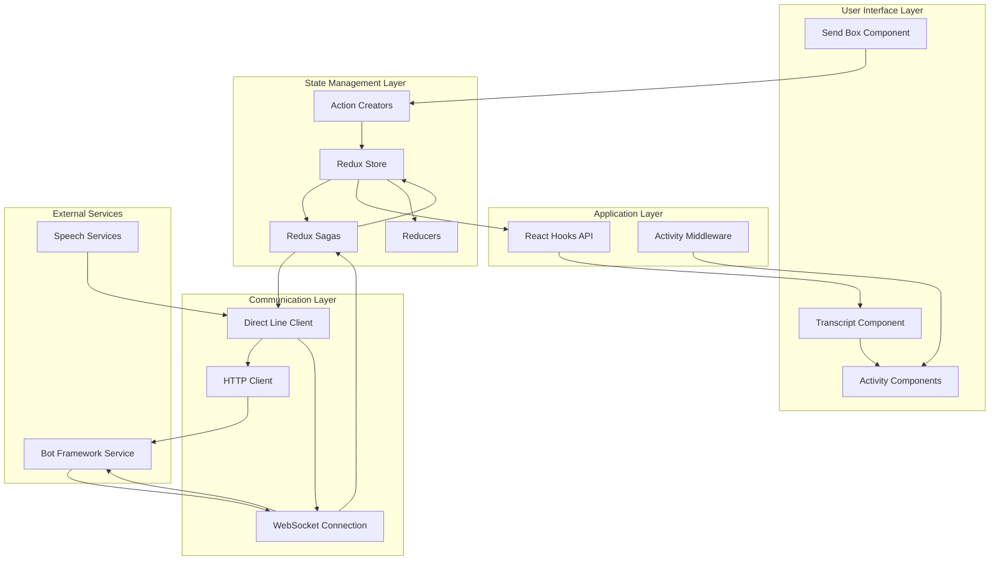
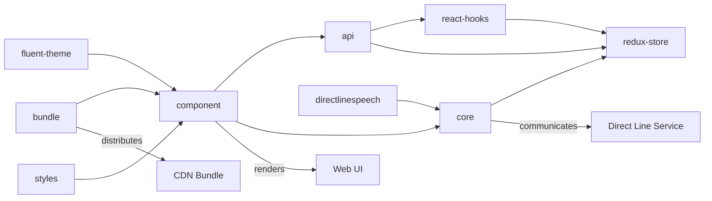
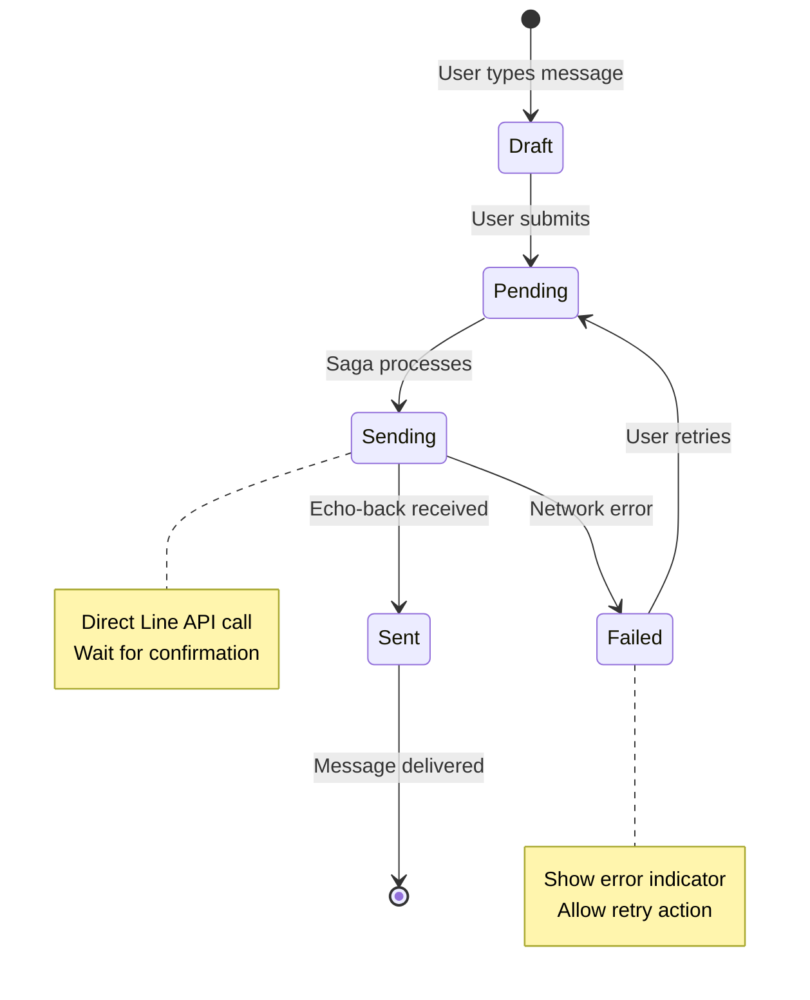
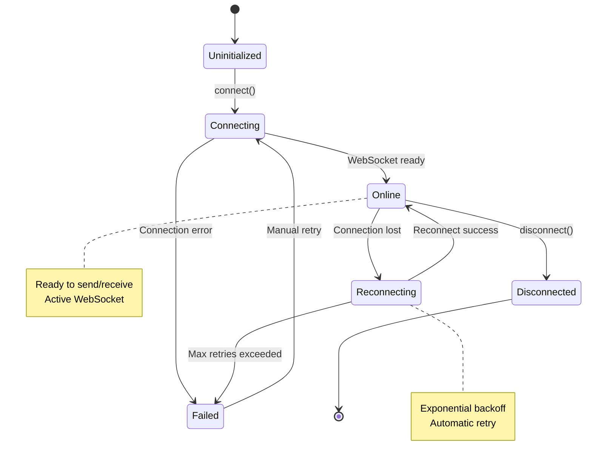
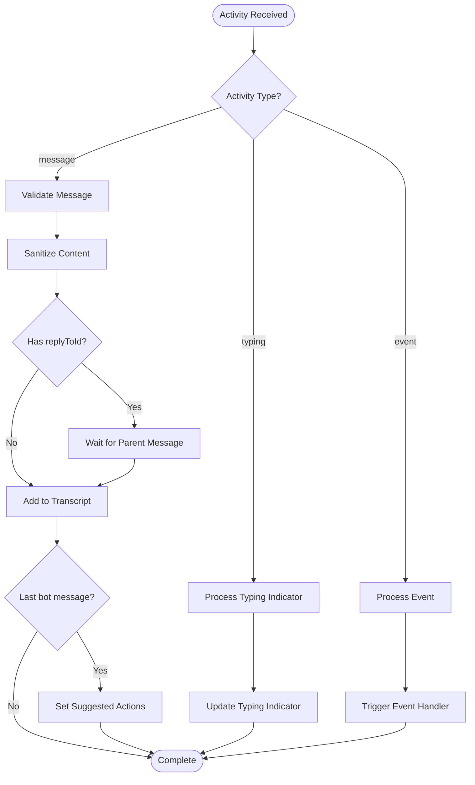
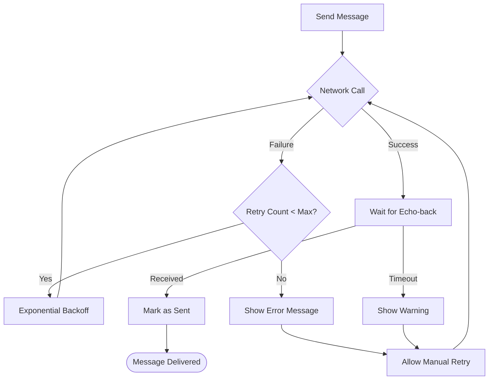

# BotFramework-WebChat Message Flow Diagrams

This document contains visual representations of the message delivery architecture in BotFramework-WebChat.

## Outgoing Message Flow (User → Bot)

## Incoming Message Flow (Bot → User)

## System Architecture Overview

## Package Dependencies

## Message State Transitions

## Connection State Management

## Activity Processing Pipeline

## Error Handling Flow

These diagrams illustrate the comprehensive message delivery system in BotFramework-WebChat, showing how user interactions flow through the various architectural layers to provide a reliable, real-time messaging experience.